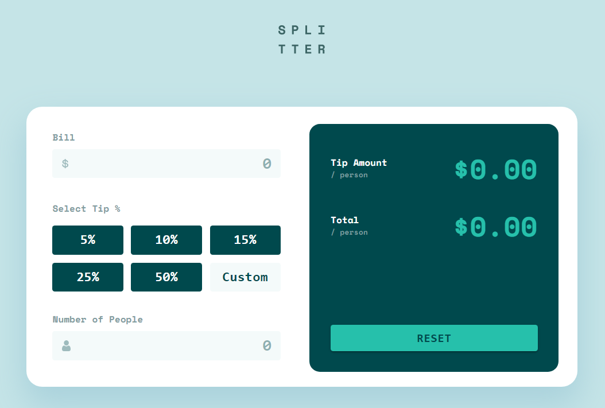
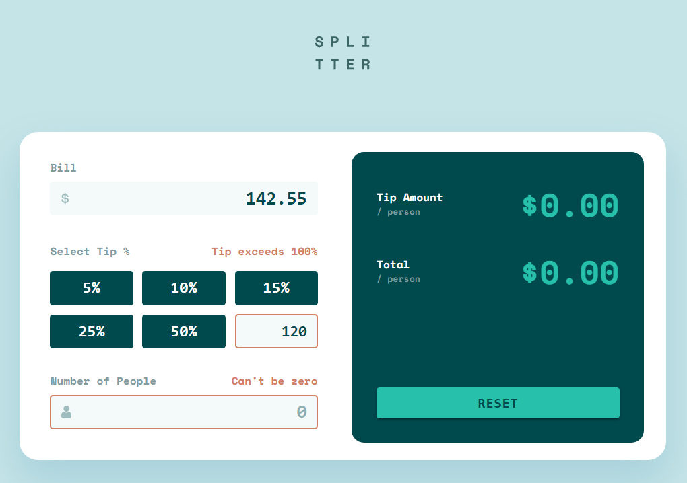
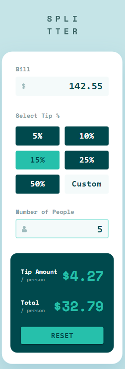

# Frontend Mentor - Tip calculator app solution

This is a solution to the [Tip calculator app challenge on Frontend Mentor](https://www.frontendmentor.io/challenges/tip-calculator-app-ugJNGbJUX). Frontend Mentor challenges help you improve your coding skills by building realistic projects.

## Table of contents

- [Overview](#overview)
  - [The challenge](#the-challenge)
  - [Screenshot](#screenshot)
  - [Links](#links)
- [My process](#my-process)
  - [Built with](#built-with)
  - [What I learned](#what-i-learned)
  - [Interesting things I discovered](#interesting-things-i-discovered)
  - [Continued development](#continued-development)
- [Development](#development)
- [Author](#author)

**Note: Delete this note and update the table of contents based on what sections you keep.**

## Overview

### The challenge

Users should be able to:

- View the optimal layout for the app depending on their device's screen size
- See hover states for all interactive elements on the page
- Calculate the correct tip and total cost of the bill per person

Extra features I added:
- Input field prevents entering non-numerical characters except for "." for decimal numbers (Copy-pasting invalid string should also be negated)
- In input fields that allow decimal numbers (**Bill** and **Custom Tip**), an entry like **".1"** will automatically turn into **"0.1"**
- **Number of people** input field accepts only positive intergers ("." is not registered)
- An error **"Can't be zero"** for **Number of people** only appears when bill is greater than 0
- A warning appears when tip is **over 100%**

### Screenshot

Desktop design




Mobile design


### Links

- Solution URL: [Github repository](https://github.com/danhalis/tip-calculator-app)
- Live Site URL: [Vercel-deployed app](https://tip-calculator-app-danhalis.vercel.app/)

## My process

### Built with

- [React](https://reactjs.org/) - JS library
- [Next.js](https://nextjs.org/) - React framework
- [Material UI](https://mui.com/) - React UI Component library
- [React Hook Form](https://react-hook-form.com/) & [class-validator](https://www.npmjs.com/package/class-validator) - For form validation
- [Tailwind](https://tailwindcss.com/) - For styles

### What I learned

- How React components get ***re-rendered based on states***
- How to ***update states from one component to another*** (between **parent/children** or **2 de-coupled components**) in React
- How to fix some ***styling conflicts*** between **Material UI** and **Tailwind**
- How to remotely debug a web app on an Android device using [Chrome's remote debugging tool](https://developer.chrome.com/docs/devtools/remote-debugging/)

### Interesting things I discovered
- `onKeyPress` event is not triggered by Chrome on Android devices. [See more](https://bugs.chromium.org/p/chromium/issues/detail?id=118639)
- How to disable `:hover` styles on touch screens using Tailwind. [See more](https://github.com/tailwindlabs/tailwindcss/discussions/1739#discussioncomment-56282)
```js
// tailwind.config.js
module.exports = {
  extend: {
    screens: {
      'betterhover': {'raw': '(hover: hover)'}
    }
  }
}
```
```css
.element {
  @apply
    betterhover:hover:(...);
}
```

### Continued development

I would like to practice using [Redux-Saga](https://github.com/redux-saga/redux-saga), [React Redux](https://react-redux.js.org/) and also some more React hooks from [here](https://medium.com/nerd-for-tech/top-10-react-hooks-library-7a7d20c4d265).

I also really want to try out  [React Native](https://reactnative.dev/) one day.

## Development

This is a [Next.js](https://nextjs.org/) project bootstrapped with [`create-next-app`](https://github.com/vercel/next.js/tree/canary/packages/create-next-app).

Run the development server:

```bash
npm run dev
# or
yarn dev
# or
pnpm dev
```

Open [http://localhost:3000](http://localhost:3000) with your browser to see the result.

## Author

Hieu Dao Le Duc
- Frontend Mentor - [@danhalis](https://www.frontendmentor.io/profile/danhalis)
- Github - [danhalis](https://github.com/danhalis)
- LinkedIn - [Hieu Dao Le Duc](https://www.linkedin.com/in/hieudaoleduc/)
